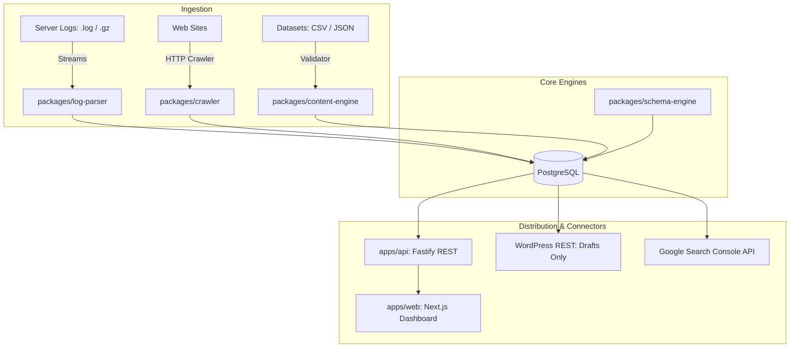

# Architecture & System Design

## Overview
Glitch SEO Ops Engine is designed as a modular monorepo separating data ingestion, analysis engines, API gateways, and user presentation.

## Module Boundaries
- **`packages/core`**: Zero external dependencies. Holds domain business models, privacy hashing, and priority formulas.
- **`packages/log-parser`**: Streaming parser with zero memory overhead, regex combined formats, bot heuristics.
- **`packages/crawler`**: Audit engine detecting over 15 categories of SEO regressions.
- **`packages/schema-engine`**: Strict JSON-LD Schema.org validator and graph builder.
- **`packages/content-engine`**: Safe template evaluator and Jaccard shingling similarity checker.
- **`packages/connectors`**: WordPress and Google Search Console adapters with built-in mock/demo modes.
